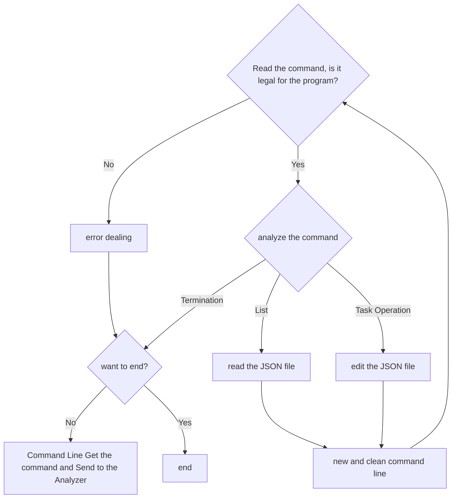

# tsk_tracker_cli
a solution to the project [Task Tracker CLI](http://roadmap.sh/projects/task-tracker)

# Main language
  C (GNU v2.35)

# Compiler
  GCC 4.7

# The Main Logic

# The Main  API
   
